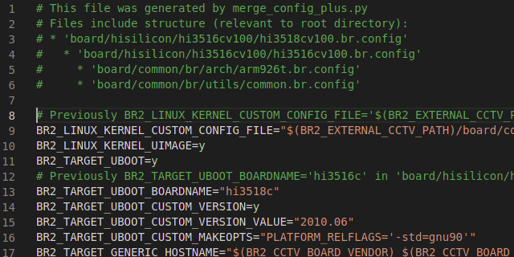

<p align="center">
 
</p>

<h3 align="center">Merge config plus</h3>

---

<p align="center">Kconfig preprocessor</p>

Tool for Kconfig's config fragments merge, inspired by `merge_config.sh`, 
extending it's capabilities.

It should help generate amount of similar (but different) parametrized configurations for Buildroot and Linux kernel, that difficult to maintain in manual mode.

**For quick start check [usage](#usage) documentation's section.**

Originally this tool was made to simplify different camera modules zoo 
config managment for 
OpenHisiIpCam's [cctv](https://github.com/OpenHisiIpCam/cctv) project.

## Installation and requirements

Python 3.6+ is needed.

```console
user@host:~$ git clone https://github.com/OpenHisiIpCam/merge_config_plus
user@host:~$ cd merge_config_plus
user@host:~/merge_config_plus$ ./merge_config_plus.sh --help
```

## TOC
* [Overview](#overview)
* [Syntax and features](#syntax-and-features)
	* [Vars](#vars)
	* [Strings](#strings)
	* [Includes](#includes)
	* [Defines](#defines)
	* [Value substitution](#value-substitution)
	* [Functions](#functions)
	* [Conditional processing](#conditional-processing)
	* [Miscellaneous](#miscellaneous)
* [Processing](#processing)
* [Usage](#usage)
	* [Simple](#simple)
	* [Advanced](#advanced)
* [Known issues and limitations](#known-issues-and-limitations)
* [Further improvements](#further-improvements)
* [References](#references)

## Overview

This tool is very simple, but full featured **Domain Specific Language** 
processor, implemented according to all canons of compiler/translator 
development (at least for the best of the creators's current knowledge),
with an eye on synctaxis and behavior of Kconfig.

Language operates with typed variables (states, integers, hexed integers, 
strings) and predefined functions. It is possible to use variable's 
value substitution and define code chunks. Processing flow control features are present 
in the form of includes and conditional operators.

## Syntax and features

### Vars

Typical Kconfig's vars:

* `VAR=y`
* `VAR=m`
* `VAR="string"`
* `VAR+=" append string on the right"`
* `VAR=100`
* `VAR=0xffa`
* `# VAR is not set`

Extended:
* `VAR=+"append string on the left "`
* `VAR-="subtract all occurrences of substring from VAR"`
* `VAR?="set if there is no already anything setuped"`
* `VAR=n # same as '# VAR is not set'`
* `VAR=%(ANOTHER_VAR)`
* `VAR=%(func "arg1")`

```
VAR=y
VAR=m
VAR=n
# VAR is not set
VAR=%(ANOTHERVAR)
VAR=%(func "arg")
VAR="string"
VAR+="string"
VAR=+"string"
VAR-="string"
```

### Strings

* Strings are used as assigns to vars or func arguments.
* String handle everything inside `""` double or `''` single quotes, except same quotes respectively.
* Strings can be multiline and processed with new lines or without (`"\\n"` -> `""`).

```
VAR=""
VAR="123"
VAR='"something in double quotes"'
VAR="1
2
3" # => "1\n2\n3"
VAR="1\
2\
3" # => "123"
``` 

Strings can be concatenated with other strings, var's values or function's result in any order.
Concatenation is done via `.` literal.

```
TEST1="1"."2 " . "3" # => "12 3"
TEST2=%(TEST1)." something" # => "12 3 something"
TEST3=%(shell "echo -n '123'") # => "123"
TEST4="test ".
$(TEST1)
."
multi
line
"
```

### Includes

Includes are implemented in place, means that include file content will be processed righ
after include statement.

Allowed path characters: upper and lowercase letters, numbers, `.` (dot), `/` (slash) 
and `_` (underscore) symbols.

**Due to implementation details `include` statement is not a function, so it is not
possible to use var`s substitution, func returns and string concatenation for the 
only one allowed argument, also argument should always exist.**

```
%(include "relative/path/to/somefile")
%(include "/absolute/path/to/somefile")
```

If path started with `/` it is recongized as absolute path, otherwise
it is recognized as relative to basedir of file, that includes target file.

It is possible to use include inside conditional statement. 
```
%(ifeq %(SOMEVAR),"y")
	%(include "true.txt")
%(else)
	%(include "false.txt")
%(endif)
```

### Defines

Define is chunk of valid statemens, that are not processed in place,
but stored internally and can be invoked with `call` function.

Defines can be declared only on highest level(means can't be declared
inside conditional statements or other defines).

Redefenition are valid, but recognized as abnormal (warning appears).

**As include statements, defines are not functions and recognized separately, to
be recognized properly argalways should exist and arg can only be a
constant string, string concatenations, val's substitions and functions
can't be used in argument.**

```
%(define "chunk_name")
	VAR1=y
	%(func "arg")
	VAR2="test string"
%(endef)
%(call "chunk_name")
```

### Value substitution

Var's values can be assigned to other vars or can be concatenated with strings.
In case of assign var keep it's type (state, int, hex, string). 
In case of concatenation (`.`) all members are casted to strings.

**Unknown vars are resolved to empty strings.**

```
VAR1=123
VAR2=%(VAR1) # => 123
VAR3="".%(VAR1) # => "123"
```

### Functions

Function accept any number of string arguments (arguments interpretated differently depending on the function). 
Function always returns string, it can be assigned to var or concatenated with other strings.
Invoke without result catch is also possible.

If function supplied with more than needed amount of arguments, extra are dropped.

There are two special functions: `file` and `save`. One load data from file, second saves data to file. 

```
# %(funcname ["arg1"[,"arg2"[,"argN"]]])
# VAR=%(funcname ["arg1"[,"arg2"[,"argN"]]])
# VAR="".%(funcname ["arg1"[,"arg2"[,"argN"]]])." some string appended ".%(VAR2)
```

#### process
Invokes separate merge_config_plus processing instance.

Any amount of args are concatenated via `\n` and processed.
base and tmp dirs are setuped as dir name of file containig invokation.
Return processed config as string.
```
PROCESS=%(process "LOCAL_VAR1=1 TEST=%(LOCAL_VAR1)")
# PROCESS="TEST=1"
```

#### format
Simple file templating (using python's `str.format()`)

Arguments:
* template string
* templating vars
* templating vars (optional)

Templating vars supposed to be `\n` separeated.
Additional templating vars arguments concatenated via `\n`.
Returns processed template as string.

```
LOCAL_TEMPLATE1="
This is template
This is var1 {var1}
This is var2 {var2}
"
TEMPLATED1=%(format %(LOCAL_TEMPLATE1), "
var1=123
var2=another test    ")
# TEMPLATED1="\nThis is template\nThis is var1 123\nThis is var2 another test\n"
```

#### call
Invoke predefined chunk processing.
Takes any arguments amount, each is treated as chunk name.

```
%(call "chunk1")
%(call "chunk1", "chunk2")
```

#### diff
Create unified formatted patch between first and second args.
Other arguments are ignored.
Returns patch as string.
```
DIFF=%(diff "text1", "text2")
```

#### shell
Execute shell script, any amount of args can be supplied,
but at least one is required and it should contains only executable name.
```
TEST1=%(shell "echo", "123")
# TEST1="123\n"
TEST2=%(shell "echo", "-n", "123")
# TEST2="123"
```

#### strip
Takes any arguments, concat them and output stripped string.
```
TEST=%(strip " ", "a", "b", "c  ")
# TEST="abc"
```

#### file
Takes any arguments amount, treats each as path to file,
reads data from files and concat them in multiple args case.
```
T1=%(file "path1")
# T1="path1 data"
T2=%(file "path2", "path3")
# T2="path1 datapath2 data"
```

#### save
Take at least one argument, that is path to file.
Other arguments treated as data that will be concatenated and saved.

**If file exist it will be overwritten!**

```
%(save "path/to/file", "data")
```

### Conditional processing

Process flow control is presented with `ifeq` and `ifneq`.
Strings, vars, functions and their concatenations can be supplied as arguments.

```
V1="string1"
V2="string2"

%(ifeq %(V1),%(V2))
	TEST="V1 == V2"
%(else)
	TEST="V1 != V2"
%(endif)

%(ifneq %(V1),"some")
	TEST="V1 != some"
%(endif)

%(ifneq %(V1),"some ".%(V5))
	TEST="V1 != some V5"
	%(shell "some_script.sh")
	%(ifeq %(V2),"".%(shell "echo -n '123'"))
		TEST2=%(V2)
	%(endif)
%(endif)
```

All braches are pasrsed, during processing step condition will be evaluated
and only suitable parts will be processed.

### Miscellaneous

Everything from `#` up to newline recognized as comment.
Comments that started with `##` are exluded from output.

```
# comment
VAR=y # comment
%(shell "arg") # comment
```

Spaces and tabs are skipped everywhere except strings. 

```
%(func "arg")
%( func		"arg"	)
TEST=y
TEST	=	y
```

## Processing

Overall tool strategy is to provide output despite error and warnings.
Practically this means that unknown vars and failed functions will be 
expanded as empty strings.

### Local vars

**LOCAL_** prefixed vars are excluded from output. 
Such named vars can be used during processing for any purpose.

There are several predefined vars:
* `LOCAL_BASE` base dir
* `LOCAL_TMP` temporary dir

## Usage

### Options

```console
user@host:~/merge_config_plus$ ./merge_config_plus.sh --help
usage: merge_config_plus.py [-h] [-v] [-d]
                            [--mode {normal,debug-lexer,debug-parser,dependencies}]
                            [-o OUTPUT] [-t TMP_DIR] [-b BASE_DIR]
                            [-f F [F ...]] [-a APPEND] [-p PREPEND]
                            [--strip-history]

Kconfig preprocessor 2.0.1 license MIT
(https://github.com/OpenHisiIpCam/merge_config_plus).

optional arguments:
  -h, --help            show this help message and exit
  -v, --version         show program's version number and exit
  -d, --debug           Show debug log (default: False)
  --mode {normal,debug-lexer,debug-parser,dependencies}
                        debug modes (default: normal)
  -o OUTPUT, --output OUTPUT
                        output to file (default: -)
  -t TMP_DIR, --tmp-dir TMP_DIR
                        temporary dir TODO (default: None)
  -b BASE_DIR, --base-dir BASE_DIR
                        base dir TODO (default: None)
  -f F [F ...], --files F [F ...]
                        input files list (default: None)
  -a APPEND, --append APPEND
                        data as string, append after files (default: )
  -p PREPEND, --prepend PREPEND
                        data as string, prepend before files (default: )
  --strip-history       Drop detailed var history from output (default: False)
```

### Simple 
This usage is similar to `merge_config.sh`

```console
user@host:~/merge_config_plus$ cat ./1.config 
TEST=n
TEST_0="TEST_0 string"
%(include "3.config")

user@host:~/ohic/REPO/preprocessor/tools/merge_config_plus$ cat ./2.config 
%(ifeq %(TEST),"y")
	TEST_4="setuped if confition is true"
	TEST_3=0xDDD
%(endif)

user@host:~/merge_config_plus$ cat ./3.config 
TEST=y

user@host:~/merge_config_plus$ ./merge_config_plus.sh -f ./1.config ./2.config -o out
mcp [INFO]: Processing to 'out' done

user@host:~/merge_config_plus$ cat ./out 
# This file was generated by merge_config_plus
# Files include structure:
# * 1.config ( from cmd line )
#   * 3.config
# * 2.config ( from cmd line )


# Previously n on 1.config:1
TEST=y
TEST_0="TEST_0 string"
TEST_4="setuped if confition is true"
TEST_3=0xddd
```

### Advanced

**TODO**

## Known issues and limitations

* Var's substition at the moment only avalible for vars, that were defined before substitution request.
* Error handling is not done well, but app will sometimes show file and line number, where error appear.
* `+=` from original config will be resolved to `=`.
* This documentation maybe does not cover all details or miss something.

## Further improvements

Obviously tool requires more tests, code refactoring, better error handling 
and more thoughtful overall planning.
Some parts were done slipshod and don't follow true python way.

But, no any improvements are planned, only bug fixes maintenance.
As tool was created for specific task, minor behaviour logic 
can be changed to fit the task more efficient way.

## References

* [Kconfig](https://www.kernel.org/doc/html/latest/kbuild/kconfig-language.html)
* [Kconfig macro language](https://www.kernel.org/doc/html/latest/kbuild/kconfig-macro-language.html)
* [merge_config.sh](https://elixir.bootlin.com/linux/latest/source/scripts/kconfig/merge_config.sh)
* [SLY (Sly Lex-Yacc)](https://github.com/dabeaz/sly)

